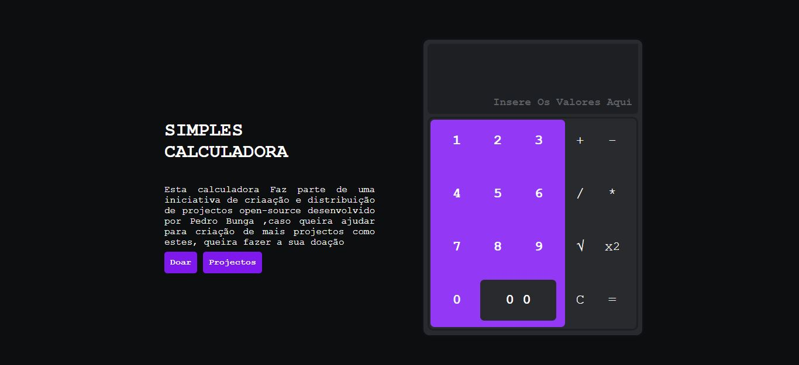

# SIMPLES CALCULADORA

Este Projecto Tem como Objectivo implementar as operações basicas de uma calculadora (Adição , Subtração, Multiplicação, Divisão,Potencia e Raiz Quadrada)

## FUNCIONALIDADES

<ol>
    <li>Adição</li>
    <li>Subtração</li>
    <li>Multiplicação</li>
    <li>Divisão</li>
    <li>Potenciação</li>
</ol>

### TUMB

#### Para mais Informações acesse as Minhas Redes Sociais
 ](./assets/icons/social%20media/facebook.png)

