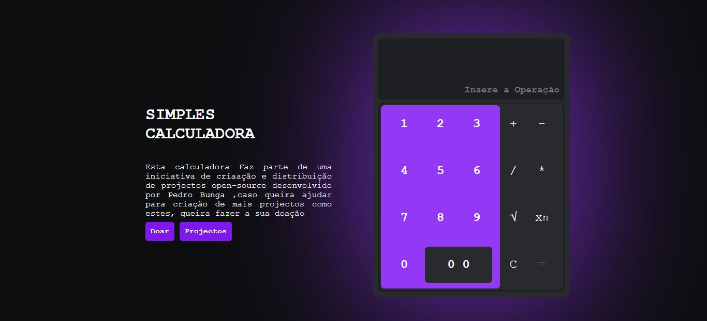

# SIMPLES CALCULADORA

Este Projecto Tem como Objectivo implementar as operações basicas de uma calculadora (Adição , Subtração, Multiplicação, Divisão,Potencia e Raiz Quadrada), Para uma calculadora versão web.

## FUNCIONALIDADES

<ol>
    <li>Adição</li>
    <li>Subtração</li>
    <li>Multiplicação</li>
    <li>Divisão</li>
    <li>Potenciação</li>
</ol>

### TUMB

#### Notas da Versão

Para Esta versão deve se Seguir os seguintes cuidados.
<ol>
    <li>Operações</li>
</ol>

 A versão atual da calculadora não Suporta operações Sucessivas como por exemplo: 24+4*7-8/4.
Suporta apenas as operações basicas entre dois numeros ou seja ; X+Y ,X-X,X*Y,X/Y, X N e  Raiz Quadrada 

#### Para mais Informações acesse as Minhas Redes Sociais
 ](./assets/icons/social%20media/facebook.png)

